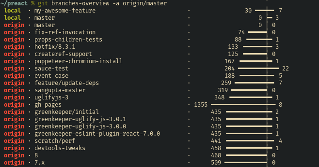

# git-branches-overview

Visualize branches 'ahead' and 'behind' commits compared to a base revision or their upstream.

## Usage

```
git-branches-overview [FLAGS] [OPTIONS] [--] [base_revision]

FLAGS:
    -l                 Show local branches (default)
    -r                 Show remote branches
    -a                 Show all branches
    -u, --upstreams    Compare branches with their respective upstream instead of the default branch
    -h, --help         Prints help information
    -V, --version      Prints version information

OPTIONS:
        --remote <remote_name>...    Only list branches from those remotes;  can be specified multiple times;  implies
                                     '-r'
        --repo-dir <path>            Repository path [default: .]

ARGS:
    <base_revision>    Revision to use as a base [default: HEAD]
```

## Screenshot


